# PYM - Plan Your Meals

PYM aims to provide a straightforward and intuitive solution, as it will allow individuals to plan and keep track of their meals for the week. This will allow individuals to reduce stress, save money and improve health.

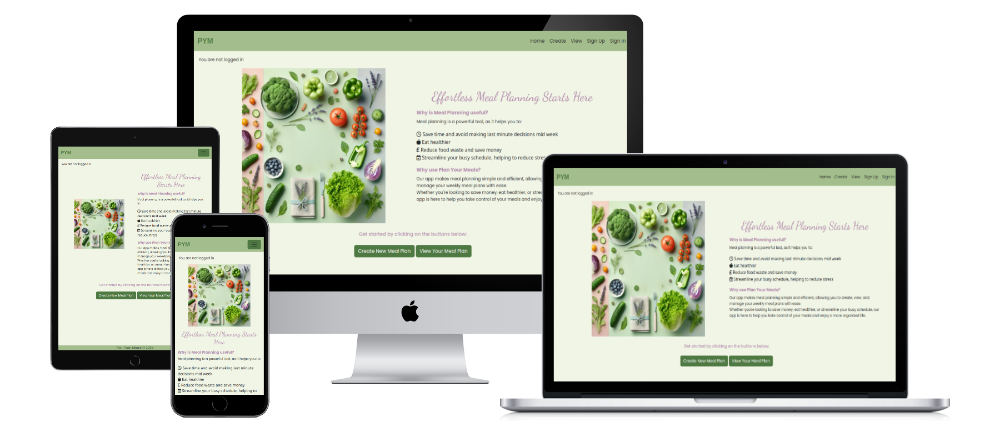

## Purpose
Life is busy. Many families struggle to stay organised and plan their meals effectively, potentially leading to increased stress, a more expensive food bill and a less nutritious diet.
In addition to the general stresses of day to day life, we are going through a cost of living crisis. The House of Commons reported in 2022/23 that around 11% of households live in food poverty. As such, it is more important than ever to start being more savvy with our money. This is where PYM comes in. Using PYM to help you plan your meals every week can help make your money go further and reduce your food waste. 

So, our purpose is simple - to help our users plan their meals, saving their time and money.

### Target Audience
Our primary target audience includes busy professionals, families, and anyone looking for help planning their weekly meals. This can be anyone that would benefit from saving time, money or both.

### Key Aims
**Simple and intuitive UX** - This will be straightforward to use from the get go, making meal planning easier, not adding more challenge.\
**User authentication** - Users will be able to login to their own accounts, meaning their meal plans are safe and saved to look back on. \
**CRUD functionality** - Users will be able to create, view, edit and delete their meal plans as they wish, making it fully adaptable.\
**Responsive design** - This will be responsive across all screen sizes, making it easy to edit your meal plan, no matter the device.\

## Minimum Viable Product
The MVP will include a meal planner, which will be in the form of a card. There will be the days of the week listed in the card and users will then be able to type the meals they are going to eat into each of these boxes. As users will be able to log in, they will have the opportunity to save, update and delete aspects of their planner, so it is always up to date. The meal plans will be listed from most recent at the top and be listed in reverse order, so the most recent plan will be most easily visible. The other plans will be listed below, so it is easy to scroll down and get inspiration from past meal plans.

### Key Features
**Homepage** \
The User first views the homepage. They can see the hero image and read the benefits of using our Meal Planner. From this page, the user can click on the buttons to create and view their meal plans directly.\
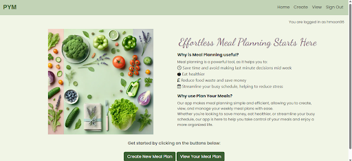

**Create your Meal Plan** \
When the User clicks the Create a Meal Plan button (either on the main page or the link on the Navbar), it takes them to this page. They can fill in the form and then click save at the bottom once complete. If any of the boxes are left blank, the page will redirect the user to the empty box for it to be filled in. The form will not submit if any box is empty.\
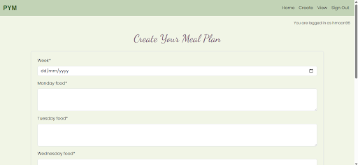 

When all the boxes are filled in and the user clicks submit, they are redirected to the view page and a notification pops up.\
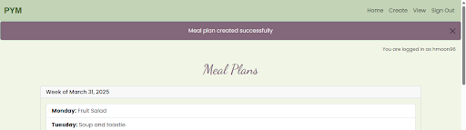

**View your Meal Plans**\
When the User clicks the View Your Meal Plan button (either on the main page or the link on the Navbar), it takes them to this page.\ All of the meal plans are listed in reverse order, with the most recent being first. This is so the users can see this week's plan straight away, but they can scroll to look at older plans easily too, for meal inspiration. This enhances the User Experience.\ From here, users can update and delete individual meal plans with ease, further allowing us to meet our aim of building a simple and intuitive app.
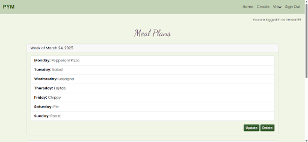 

**Update your Meal Plan**\
When Users click the Update button next to the plan, they are taken to this page. They are then able to alter any box in the form as they see fit, as well as the date. \
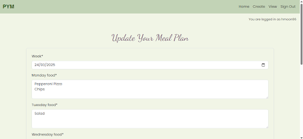 

When the user has updated the plan (all the boxes must still be filled in) and the user clicks submit, they are redirected to the view page and a notification pops up.\
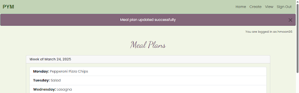 

**Delete your Meal Plan**\
If a User wants to delete a plan, they must click on the delete button. This takes them to this page.\
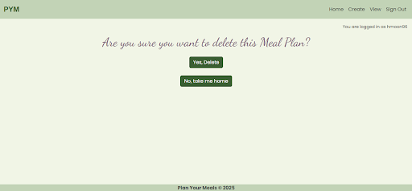 

If they click on the "No, take me home button", they are taken back to the view page. Nothing will have changed, their plan will still be there and no notification will display. \
If they click "Yes, Delete". The plan will be deleted from the view, they are redirected to the view page and a notification pops up.\
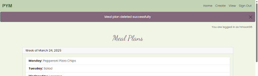 

## Other Features - Prioritisation
There are other features that I would like to include to enhance the user experience and make the app even more useful. I will list these in order of priority:
1) Ability to share and download the meal plan, to share with family members
2) Enhance the log in functionality, so multiple users can log into the same account
3) Meal library with recipes and ingredients
4) To do list which auto fills from the recipe, based on ingredients
5) Include a cost calculator which predicts the average cost of meals, to help with budgeting
6) Include calorie/nutitional information

## Planning

### User Stories and Agile Methodology

I have been using a Kanban board to ensure I work in an Agile way and meet the MVP on time. 

This Kanban Board includes the following 8 User Stories:
- User Story 1: As a user, I want to create a weekly meal plan so that I can stay organized and plan my meals effectively.
- User Story 2: As a user, I want to view my weekly meal plan so that I can see what meals I have planned for the week.
- User Story 3: As a user, I want to edit my weekly meal plan so that I can make changes to my planned meals.
- User Story 4: As a user, I want to delete a meal from my weekly meal plan so that I can remove meals I no longer want to include.
- User Story 5: As a user, I want to generate a shopping list based on my weekly meal plan so that I can easily buy the ingredients I need.
- User Story 6: As a user, I want to download the meal plan so that I can share it or print it out.
- User Story 7: As a user, I want to have multiple logins per account so that my family members can collaborate on the meal plan.
- User Story 8: As a user, I want to create meals and save them in a library so that I can easily add them to my meal plan.

The first four User Stories are the current features, which make up the MVP. The last four features are listed above as other features and were listed on the board as Should haves and Could haves. 

For each of the user stories, there are acceptance criteria and tasks, to really help me to focus and keep on track.

Link to the Canban Board: https://github.com/users/hmoon96/projects/10 

### Database Structure and relationships
**Models**
In my project, I used a PostgreSQL database to store User data. Within this database, I used two models:

#### User Model
The first is the User Model. This uses the Django Built in model to structure the user log in information.
- id (Primary Key, Default in Django model)
- Username (VarCharField, Unique)
- Email (EmailField)
- Password (VarCharField)

#### MealPlan Model 
The Meal Plan model is a custom model. It represents the Users Meal Plans. Each meal plan is associated with a user account (through the User Foreign Key). Only the meal plans that were created by the user are visable to that user, they cannot see anyone else's meal plans. When a User is deleted, all of their meal plans are deleted too. 
| Field | Value | Purpose |
|-------|-------|---------|
| User | models.ForeignKey | This connects the User account to the individual meal plans | 
| Week | models.DateField() | This allows the User to open the calendar and select the date for the meal plan to start. This helps with the structure of the meal plans on the View Meal Plans page |
| monday_food | models.TextField() | Users can write their food for this day in the box, which will then be saved to the plan |
| tuesday_food | models.TextField() | Users can write their food for this day in the box, which will then be saved to the plan |
| wednesday_food | models.TextField() | Users can write their food for this day in the box, which will then be saved to the plan |
| thursday_food | models.TextField() | Users can write their food for this day in the box, which will then be saved to the plan |
| friday_food | models.TextField() | Users can write their food for this day in the box, which will then be saved to the plan |
| saturday_food | models.TextField() | Users can write their food for this day in the box, which will then be saved to the plan |
| sunday_food | models.TextField() | Users can write their food for this day in the box, which will then be saved to the plan |

#### Database model diagram
Please find below the database model diagram. I have made some changes to the model as I developed, such as removing the created at and updated on timestamps. This is because I didn't believe that they really served a purpose or added to the UX. 

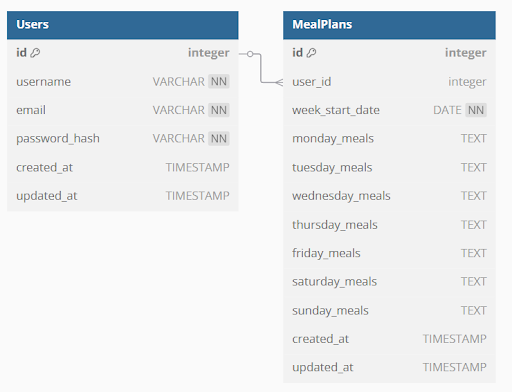

### User Flow Diagram
Below is my User Flow Diagram. This is a simple structure, which aims to fulfill the purpose of being a simple and intuative app. Although there have been some changes to the flow throughout the development process, the core of this structure has remained the same. Users cannot perform any of the CRUD functions without logging it, as the meal plans need to be linked to a user in the database. 

## UX Design 
### Wireframes 
This is how I designed the landing page. I wanted it to have a simple and clean design, which is intuitive for users. I decided to have a hero image, to add a vibrancy to the app from the get go, then include a little bit of information about the purpose of the app below. I also made the nav bar and buttons clear, so the users can easily log in, log out, sign up, create and view plans from the home screen.
 /

The Mobile, Tablet and Laptop views of the viewing screen were designed as a table. The idea behind this was that it would be easier for the user to read which meals were for which day. However, as my design evolved, I decided to change this layout to a Bootstrap card. This is because it was easier to make this responsive across all screen sizes, therefore a better User Experience overall. From this page, users can update and delete their plans, completing the CRUD functionality designed.

 /

 /

 /

### Fonts
As the target audience are families and individuals who need help with organising their meals, I wanted to make sure that the fonts chosen were selected carefully to appeal to this audience. 

The font for the H1 elements is Dancing Script. This is a handwritten, cursive font which is friendly and elegant, whilst being easy to read.

The font for the body of the site was Poppins. This is a modern sans-serif font, making it very easy to read. It still adds to the friendly, supportive feel of the site. 

### Colours
The colours were also chosen to evoke calmness for the User, and convey friendliness. 
- The background is a very light shade of green, to add a freshness to the site but maintain the readability, without using white.
- The navbar is a different, darker shade of light, sage green. This keeps a calm, fresh and friendly feel.
- The buttons continued with the green theme, this time with a dark forest type of green. This maintains the colour scheme but adding matching accents.
- The text colour is a dark grey, so that the readability was optimum without using a harsh black.
- The secondary colour chosen was a darker lavendar purple. This is a gentle colour which pairs well with the sage green and adds a classy, calming touch to the app.

## Responsiveness
Using Chrome DevTools, I have been able to screenshot how my app is responsive across multiple screensizes.

iPhone 12 Pro:

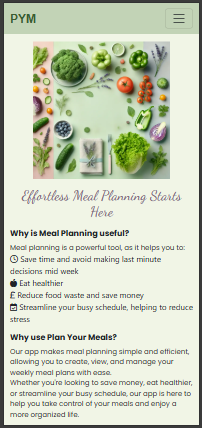 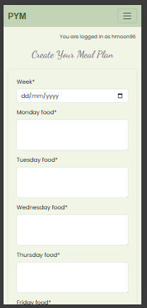 
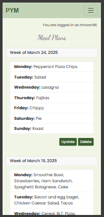  
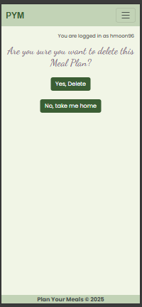 

iPad Pro:

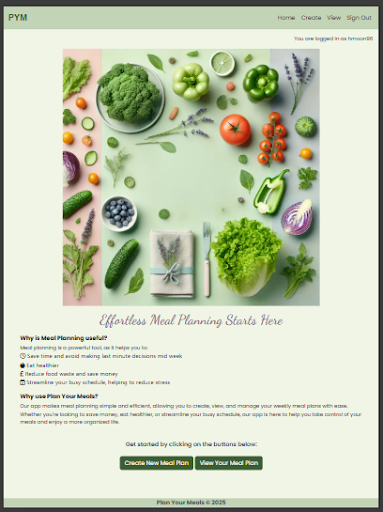 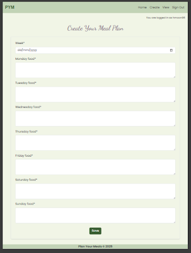 
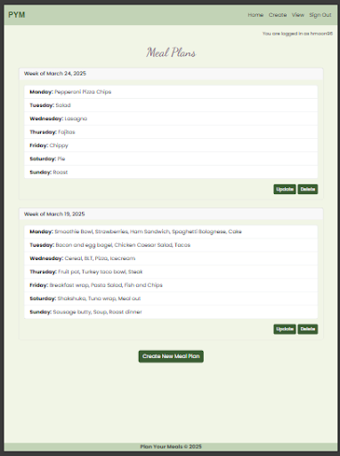 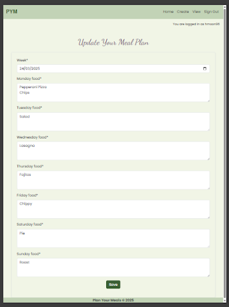 
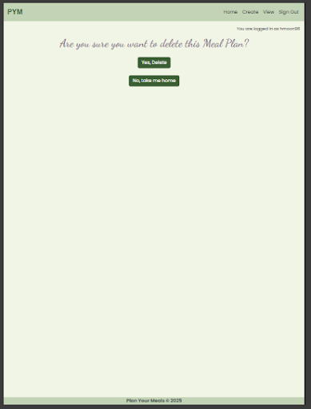 

Laptop:

 
 
 
 

## Manual Testing
| Page |     Feature     |            Action            |                     Effect               |
|------|-----------------|------------------------------|------------------------------------------|
|Homepage | Create New Meal Plan Button | Click | Takes the user to the create a meal plan page If not logged in, it takes users to the sign in page.|
|Homepage | View New Meal Plan Button | Click | Takes the user to the view your meal plans page. If not logged in, it takes users to the sign in page. |
|Navbar | Site initials (PYM) | Click | Sends the user to the homepage from all other pages. |
|Navbar | Create | Click | Takes the user to the create a meal plan page If not logged in, it takes users to the sign in page.|
|Navbar | Home | Click | Sends the user to the homepage from all other pages. |
|Navbar | View | Click | Takes the user to the view your meal plans page. If not logged in, it takes users to the sign in page. |
|Navbar | Sign Up | Click | Takes the user to the sign up page to make an account. |
|Navbar | Sign In | Click | Takes the user to the sign in page to sign into their account. |
|Sign In Page | Sign up link | Click | Takes the user to the sign up page if they don’t have an account. |
|Sign In Page | Username Validation | Enter incorrect username | Error message “The username and/or password you specified are not correct”. |
|Sign In Page | Password Validation | Enter incorrect password | Error message “The username and/or password you specified are not correct”. |
|Sign In Page | Remember Me  | Tick box | Keeps the user signed in. |
|Sign In Page | Sign In Button | Click | Signs the user in and redirects to the home page. A success message pops up. |
|Sign Out Page | Sign Out Button | Click | Signs the user out and redirects the user to the homepage. A success message pops up. |
|Sign Out Page | Cancel Button | Click | Leaves the user signed in and redirects to the homepage. |
|Sign Up Page | Username Validation | Typed Username that exists | Error message “A user with that username already exists” - account not created. |
|Sign Up Page | Password Validation | Typed password that doesn’t match the requirements | Error message that informs the user the exact issue with the password and doesn’t create the account. |
|Sign Up Page | Password Validation | Typed two passwords that didn’t match | Error message “You must type the same password each time” and the account isn’t created.|
Sign Up Page | Sign In | Click | This takes the user to the sign in page if they have an account already. |
Sign Up Page | Sign up button | Click | When all of the fields are filled in correctly, it creates the account, logs the user in and redirects the user to the home page. A success notification is shown. |
Create Meal Plan Page | Week box | Select date from calendar | This sets the date for the meal plan, which is displayed in the View Meal Plan page. |
Create Meal Plan Page | Week box | No date selected | The form doesn’t submit and skips back to the right section, so the user can select a date. |
Create Meal Plan Page | Food boxes | Text in all boxes | Text is shown in the View Meal Plan Page |
Create Meal Plan Page | Food boxes | Any text box empty | The form doesn’t submit and skips back to the right section, so the user can fill out the box. |
Create Meal Plan Page | Save | Click | Meal plan created and the user is redirected to the View Meal plans page, where they can see their plan. Success notification displayed. |
View Meal Plan Page | Create New Meal Plan Button | Click | Takes the user to the Create a Meal Plan page. |
View Meal Plan Page | Update | Click | Takes the user to the Update your Meal Plan page for that specific plan. |
View Meal Plan Page | Delete | Click | Takes the user to the Delete page. |
Update Meal Plan Page | Save | Click | Saves any changes that have been made. Redirects the user back to the view page and the changes are displayed. Success message is shown. |
Delete Meal Plan Page | Yes, Delete | Click | Deletes the plan. Redirects the user back to the view page and the plan will be gone. Success message is shown. |
Delete Meal Plan Page | No, Take Me Home | Click | Takes the user back to the view page. The plan will not be deleted and the view will remain unchanged. |

## Lighthouse
I generated Lighthouse reports for my app. The results are below: 

### Laptop 
- Home
  
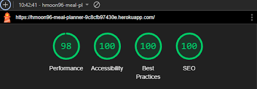

- Create

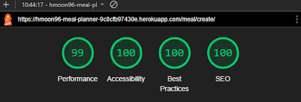

- View

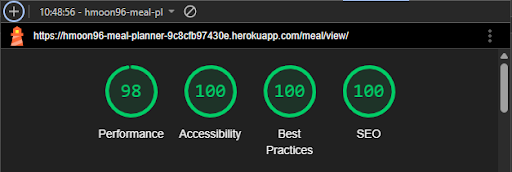

- Update

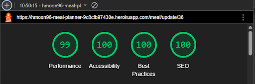

- Delete

### Mobile 
- Home
  
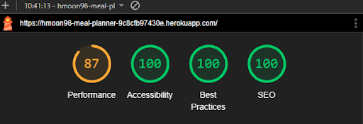

- Create

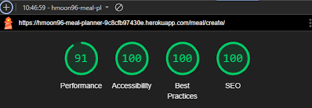

- View

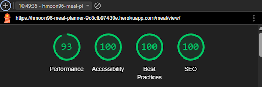

- Update

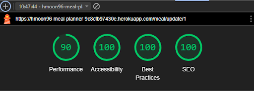

- Delete

### To note
Although the Best Practice, Accessibility and SEO scores were consistently 100 throughout testing, the performance score seemed to differ. This depended on whether I was testing the performance on a mobile or a laptop. The laptop score is higher than the mobile, with scores or 98 and 99 across the board. The mobile score has been as low as 85 and as high as 93, depending on the time of testing and the page being tested.

## Code Validation
### HTML
| HTML Doc | Passed Validation? (No Errors) | Any warnings? |
|----------|--------------------------------|---------------|
| home.html | Yes, no errors | Two |
| create.html | Yes, no errors | No |
| view.html (when there are no meal plans to view) | Yes, no errors | No |
| view.html (when there are three meal plans to view) | Yes, no errors | No |
| update.html | Yes, no errors | No |
| delete.html | Yes, no errors | No |

All files were validated using https://validator.w3.org/ 

### CSS
I checked the only CSS file for the project (style.css) and there were no errors. I used https://jigsaw.w3.org/css-validator/validator

### Python
All of the PY files were tested twice. Throughout the process with the Flake8 extension in VS Code and at the end, with the Code Institute Linter - https://pep8ci.herokuapp.com/# 

## AI
I have used CoPilot and Chat GPT on a number of occasions to help me to:
1) Develop my user stories, acceptance criteria and tasks.
2) Develop my code, to implement the CRUD

1. Navbar and Links
Issue: Your navbar links were not working correctly.
Solution:
Ensured the base.html template used  tags with correct URL names matching those in urls.py.
Added conditional logic in the navbar to show "Login," "Register," or "Logout" links based on the user's authentication status.
2. Restricting Access to Meal Plans
Issue: Users could view, edit, or delete meal plans that didn't belong to them.
Solution:
Updated views (MealView, CreateMeal, UpdateMeal, DeleteMeal) to filter meal plans by the logged-in user using request.user.
Used get_object_or_404 with user=request.user to ensure only the owner of a meal plan could access it.
Applied the @login_required decorator to restrict access to authenticated users.
3. Removing the user Dropdown in the Meal Plan Form
Issue: The user field appeared as a dropdown in the meal plan creation form.
Solution:
Excluded the user field in the MealPlanForm.
Set the user field programmatically in the CreateMeal view using meal_plan.user = request.user.
4. Displaying Meal Plans in a Table
Issue: Meal plans were not displayed in a structured format.
Solution:
Updated the view.html template to display meal plans in a Bootstrap-styled table.
Added an "Actions" column with "Update" and "Delete" buttons for each meal plan.
5. Fixing the Week Field in Meal Plans
Issue: The week field was not displaying correctly in the view.html template.
Solution:
Ensured the week field was accessed inside the  loop.
Provided options to display the week for each meal plan or just the first meal plan.
6. CSS Not Being Applied
Issue: Your custom CSS was not being applied to the project.
Solution:
Verified the STATIC_URL and STATICFILES_DIRS settings in settings.py.
Ensured the CSS file was correctly linked in base.html using .
Checked the directory structure to confirm the CSS file was in the css folder.
Suggested clearing the browser cache and using developer tools to debug.
7. Styling the Project
Issue: You wanted to apply consistent styling to the project.
Solution:
Helped define CSS variables in the :root selector for colors and fonts.
Styled headings, the navbar, and buttons using the defined variables.
Ensured the @import rule for Google Fonts was correctly placed at the top of the CSS file.
8. General Debugging and Best Practices
Issue: Various errors and inconsistencies in views, templates, and CSS.
Solution:
Debugged issues like "media query expected" and missing semicolons in CSS.
Ensured proper use of Django's template inheritance system with .
Suggested using get_object_or_404 for secure access to objects in views.

### **1. Navbar Styling**
- **Issue**: You wanted to style the navbar and its elements.
- **Solution**:
  - Styled the `.navbar-brand` with a bold font, uppercase text, and hover effects.
  - Styled `.nav-link` elements with consistent colors and hover effects using your defined CSS variables.

---

### **2. Centering Buttons**
- **Issue**: The buttons on your `home.html` page were not centered.
- **Solution**:
  - Used Bootstrap's `text-center` class to center the buttons.
  - Added `mx-2` to create spacing between the buttons for a cleaner look.

---

### **3. Bullet Points in Lists**
- **Issue**: You wanted to remove bullet points from the `<ul>` list in `home.html`.
- **Solution**:
  - Used Bootstrap's `list-unstyled` class to remove bullet points.
  - Provided a custom CSS solution (`list-style-type: none;`) for flexibility.

---

### **4. Adjusting Spacing Between Elements**
- **Issue**: The `<h6>` and `
` elements in `home.html` had too much space between them.
- **Solution**:
  - Reduced spacing by using Bootstrap's `mb-*` and `mt-*` classes (e.g., `mb-1`, `mt-0`).
  - Provided a custom CSS solution for reusable spacing adjustments.

---

### **5. Improving the `<h1>` Heading**
- **Issue**: You wanted a better `<h1>` heading for your app.
- **Solution**:
  - Suggested several engaging and descriptive `<h1>` headings, such as "Plan Your Meals with Ease" and "Effortless Meal Planning Starts Here."
  - Incorporated Font Awesome icons into the heading for visual appeal.

---

### **6. Styling the Form in `create.html`**
- **Issue**: The form in `create.html` needed styling to match the rest of the app.
- **Solution**:
  - Used Bootstrap classes (`p-4`, `border`, `rounded`, `shadow-sm`, `bg-light`) to style the form.
  - Styled the "Save" button with `btn btn-primary` for consistency.
  - Added error messages with `alert alert-danger` for better user feedback.
  - Provided a custom CSS option for further customization.

---

### **7. Customizing Buttons**
- **Issue**: You wanted consistent button styling across the app.
- **Solution**:
  - Styled buttons globally in style.css using the `.btn` class.
  - Added hover effects to change the background color and maintain consistency with your app's theme.

---

### **8. General CSS Improvements**
- **Issue**: You wanted the app's design to feel cohesive.
- **Solution**:
  - Used your defined CSS variables (`--primary-color`, `--secondary-color`, etc.) for consistent colors and fonts.
  - Styled specific elements like `.form`, `.table`, and `#table-header` to match the app's theme.

---

## Deployment and how to deploy

## Libraries and Programmes Used
- https://dbdiagram.io/home/
- https://miro.com/templates/user-flow/
- Google Fonts
- Coolors.co
- Cloudinary
- Heroku
- https://ccbv.co.uk/projects/Django/5.0/
- https://websitemockupgenerator.com/

### Other Resources
https://commonslibrary.parliament.uk/research-briefings/cbp-9209/

## Credits
